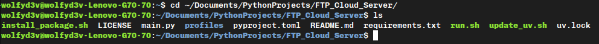
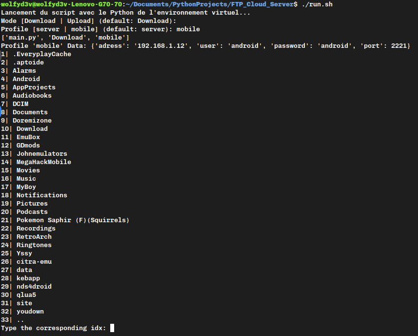

# Python FTP Client

## The Project: Why did I created this beauty?
A long time ago I've got the idea to have my own Local Cloud Server, to not depend on Google Drive (I don't really trust them since the rise of AI) \
At first I wanted to buy a NAS, but 300 euros is too much for a broke solo dev.

So I've asked myself: "Why not use my old own laptop that runs AntiX because this is the perfect Linux distribution for a 2Gb RAM garbage to create my own Cloud Server with FTP?" \
Yes... That's a great idea!

A great idea that need a client side tool to connect to my amazing server with 60 Gb of storage. \
This tool is My OWN FTP Client made in Python of course :)

## How to use this Client?
1. Get a local copy the the repository
2. Install on your system [UV](https://github.com/astral-sh/uv)
3. Open a terminal app, inside the folder of the local copy 
4. Install the package ```ftputil``` with ```uv add ftputil```
5. Configure your own profiles, very important!
6. Type ```./run.sh``` and fil the prompts given 
7. Enjoy!

Go to the folder of the project on your terminal, then type "./run.sh"
